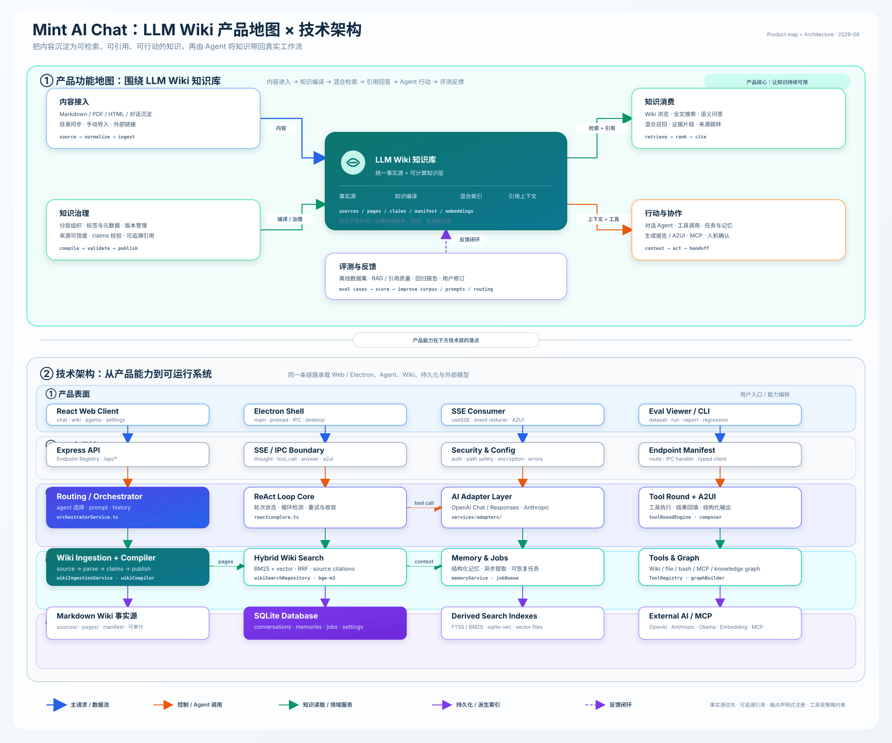

# Mint

[](LICENSE)
[](https://www.electronjs.org/)
[](https://nodejs.org/)
[](https://react.dev/)
[](https://www.typescriptlang.org/)
[](https://vitejs.dev/)
[](https://github.com/dingw530/mint-ai-chat)

Mint 是一款以个人知识工作台为核心的 AI 助手，基于 Electron 构建为桌面应用。它将文档、网页和对话整理为可检索、可持续维护的 Wiki，并通过带来源引用的知识问答、Agent 和工具调用帮助用户理解与使用这些知识。会话、设置和 Wiki 默认保存在本机；对话及配置的向量/语义服务会按用户设置连接相应 API。

https://github.com/user-attachments/assets/2df6b2b2-5c6e-4eca-b652-553c8c6ccf1b

## 功能特性

- **个人知识工作台** —— 默认进入 Wiki，集中浏览来源文档、整理后的知识页面、索引状态和摄入任务
- **知识采集与整理** —— 导入文件、网页和聊天内容；后台任务将资料编译为 Wiki 页面，并在意外中断后恢复未完成的提交
- **混合知识检索与问答** —— 结合全文和向量检索，从 Wiki 中查找相关内容并在对话中提供来源引用；可选启用实验性 Jev 语义重排
- **知识图谱与热度视图** —— 浏览 Wiki 中的概念、实践、方法论关系，以及知识页面的使用情况
- **Agent 与工具** —— 创建自定义 Agent，使用自动或手动路由、ReAct 工具循环、工具权限确认和流式响应
- **长期记忆、Skills 与 MCP** —— 管理用户记忆，从本地 Markdown 加载 Skills，并连接 MCP Server 扩展工具
- **多模型接入** —— 配置 OpenAI、Anthropic 或兼容 OpenAI 的模型端点
- **本地数据与桌面体验** —— 使用 SQLite 保存应用数据，以 AES-256-GCM 加密 API 密钥，并提供 macOS 原生窗口效果

## 技术栈

- **桌面端**：Electron 41.7.1，使用 contextBridge 和 IPC 连接渲染进程与主进程
- **前端**：React 18.3、Vite 5.4、TypeScript 6、React Router、Radix UI 与原生 CSS 设计令牌
- **服务端**：Node.js 20.19.4、Express 4.22、TypeScript 6；AI 接入使用 Vercel AI SDK 及 OpenAI、Anthropic、OpenAI-compatible providers
- **数据与检索**：better-sqlite3 12.8、SQLite FTS 和 sqlite-vec；支持配置外部 Chroma 向量库及 OpenAI-compatible embeddings
- **Agent 集成**：Model Context Protocol SDK、SSE 流式传输、Langfuse / OpenTelemetry 可观测性
- **评测与测试**：独立的 `agent-eval` Wiki-RAG 评测与报告查看器；Vitest 1.6

## 快速开始

### 环境要求

- Node.js 20.19.4

Server、Vitest 和 server 构建脚本会自动校验并使用 Node.js 20.19.4。首次运行前执行：

```bash
nvm install 20.19.4
nvm use
```

### 安装

```bash
# 在仓库根目录安装所有 workspace 依赖
npm install
```

### Web 开发模式

HTTP 模式下，server 需要配置用于加密 API 密钥等敏感数据的
`AI_CHAT_ENCRYPTION_KEY`。可以将它维护在 `server/.env` 中：

```dotenv
# server/.env
AI_CHAT_ENCRYPTION_KEY=<openssl rand -hex 16 生成的值>
```

也可以通过 shell 环境变量临时设置：

```bash
export AI_CHAT_ENCRYPTION_KEY="$(openssl rand -hex 16)"
npm run dev
```

默认访问地址：

- 前端：<http://localhost:5800>
- API：<http://localhost:3001>

端口可通过 `PORT`（server）、`VITE_DEV_PORT`（前端）和
`VITE_API_PROXY_TARGET`（前端 API 代理）覆盖。若 server 默认端口被占用，
它会自动回退到随机端口；此时请以 server 日志中的实际端口为准，并同步调整
`VITE_API_PROXY_TARGET`。

### Docker（仅本机访问）

```bash
AI_CHAT_ENCRYPTION_KEY="$(openssl rand -hex 16)" docker compose up --build
```

官方 Compose 仅将服务发布到 <http://localhost:3001>。Mint 的 HTTP API 没有用户认证；请勿通过局域网地址、反向代理、host networking 或自定义端口映射将其对外暴露。CORS 不构成访问控制。

### Electron 开发模式

```bash
# 启动完整的 Electron 开发环境（server、Vite 和 Electron）
npm run electron:dev:server

# 仅启动 Vite 和 Electron；要求已有 server 监听 3001
npm run electron:dev
```

Electron 主进程会在首次启动时于 `~/.mint/.env` 自动生成并持久化
`AI_CHAT_ENCRYPTION_KEY`，无需手动导出密钥。Electron 开发模式默认使用
`http://localhost:5800`，并假设 server 运行在 `3001` 端口。

### 构建桌面应用

```bash
# macOS
npm run electron:build:mac
```

构建产物位于 `electron/release/`。

打包、原生依赖或 Electron 配置变更后，运行以下命令从全新 `.app` 中检查 `app.asar`、`app.asar.unpacked` 与 sqlite-vec 动态库：

```bash
npm run verify:electron-artifact:mac
```

### 测试

```bash
# 与 pre-commit 一致的源码基线
npm run verify:source

# 按变更面选择验证；UI/Wiki profile 必须绑定 SDD change
npm run verify:change -- --profile agent-runtime
npm run verify:change -- --profile ui --change 2026-08-16-example
```

## 项目简介

Mint 的核心定位是个人知识工作台。默认首页围绕 Wiki 展示知识内容和索引状态，用户可以从原始资料开始采集，经由编译与生命周期管理形成知识页面，再用检索、引用问答、图谱和 Agent 工具调用来使用这些知识。

产品围绕以下能力构建：

- **知识采集与生命周期** —— 上传文件、从 URL 或对话保存资料；摄入任务持久化，重启后可以恢复已编译但未完成提交的内容
- **混合检索** —— Wiki 页面按标题和章节切分，使用全文检索与向量检索召回，再以 RRF 排序；可选的 Jev rerank 默认关闭，失败时回退到原排序
- **来源问答** —— Agent 可检索 Wiki 并在回答中呈现命中的页面、章节和引用信息
- **Agent 与 ReAct** —— 支持自定义提示词、自动路由或固定 Agent，以及多轮工具调用和流式输出
- **工具与审批** —— 内置 Wiki、文件、HTTP 等工具；按工具策略执行权限检查，并可在需要时等待用户批准
- **MCP 与 Skills** —— 动态管理 MCP Server 连接，并从本地 Markdown 文件加载 Skills
- **长期记忆与上下文管理** —— 按类别保存、召回用户记忆，并通过上下文窗口控制对话历史
- **知识浏览** —— 提供文档、知识图谱和知识热度视图；图谱包含概念、实践和方法论节点
- **模型与数据** —— 支持 OpenAI、Anthropic 和兼容 OpenAI 的端点；应用数据使用本地 SQLite，API 密钥以 AES-256-GCM 加密存储
- **运行与观测** —— Web 模式通过 Express 提供 HTTP/SSE；Electron 模式通过 IPC 调用主进程服务，并支持 Langfuse / OpenTelemetry 追踪
- **独立评测** —— `agent-eval/` 提供 Wiki-RAG 数据集、运行记录、来源追溯指标和可视化报告

## 架构

<p align="center">
  
</p>

在 Electron 模式下，应用会在**同一进程内**运行 server：服务模块直接加载到主进程中，并通过 IPC handler 调用，完全绕过 HTTP。这可以消除网络开销，并让渲染进程直接访问服务。

```
渲染进程（React）
    ↕ IPC (contextBridge)
主进程
    ├── 服务层（对话、Agent、Wiki、记忆、工具、设置与 MCP）
    ├── SQLite（better-sqlite3、FTS、sqlite-vec）
    └── AI SDK providers（OpenAI、Anthropic、OpenAI-compatible）
```

## 项目结构

```
electron/             # Electron 主进程
  main.js             # 创建窗口、IPC handlers、生命周期管理
  preload.js          # 向渲染进程暴露的 contextBridge API
  logger.js           # 基于文件的日志

client/               # React SPA（渲染进程）
  src/
    features/         # 按功能组织的 chat、wiki、agents、settings 等模块
    components/       # 共享 UI 组件
    hooks/            # useSSE、IPC 与客户端状态 hooks
    services/         # API 客户端（自动识别 Electron 与 HTTP）
    styles/           # 设计系统（CSS 自定义属性）

server/               # Express 服务与 Agent runtime（TypeScript）
  index.ts            # 入口
  endpoints/          # 声明式 HTTP / Electron IPC endpoint 注册
  services/           # 业务逻辑层
  repositories/       # 数据访问层（SQLite）
  __tests__/          # 集成测试与单元测试

agent-eval/           # Wiki-RAG 评测 CLI、数据集与报告查看器
```

## 许可证

MIT
