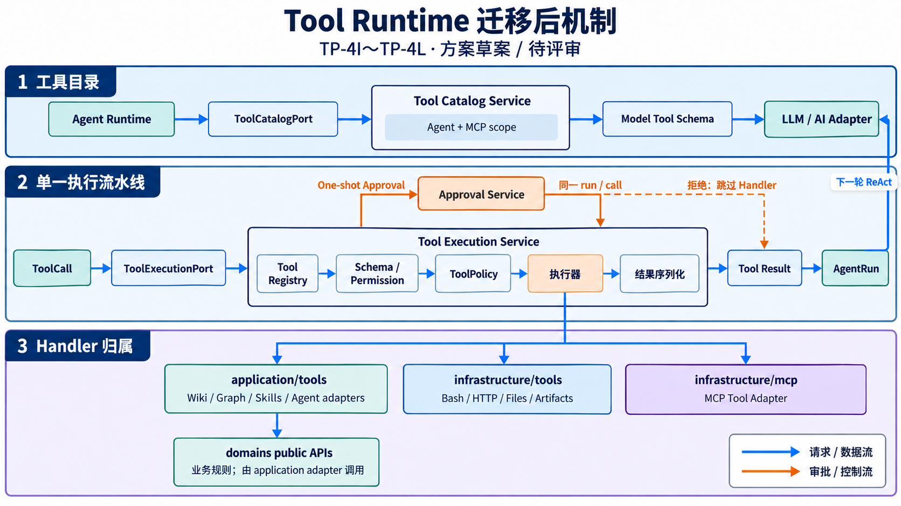

# 设计提案：Server 目录与领域边界收敛

## 文档信息

| 属性         | 值                                         |
| ------------ | ------------------------------------------ |
| 文档编号     | DSGN-20260929-001                          |
| 状态         | 执行中（TP-4A～TP-4M 已验证；TP-5 待启动） |
| 创建日期     | 2026-09-29                                 |
| 关联执行计划 | [exec-plan.md](exec-plan.md)               |
| 追溯         | [traceability.md](traceability.md)         |

## 最新进度（2026-10-05）

- 2026-10-04 提交 `ca21878 refactor(server): move AI, Wiki, and A2UI modules to layer owners` 完成 TP-4F～TP-4H：Settings/MCP/向量、Jev/vector 运行模块、Wiki rerank、AI provider adapters 与 A2UI transport 归入各自的 application/domain/infrastructure 责任层。入口和外部调用契约保持不变。
- 正常 `verify:source` Hook 全部通过：Server 134 个测试文件/1125 项通过、16 项跳过；Client 25 个文件/90 项通过；agent-eval 9 个文件/57 项通过；engineering tests 9/9、typecheck、lint 与全部构建通过。此次验证没有调用真实模型提供商。
- 2026-10-05 用户授权按 Tool 方案实施，并扩展目标为迁出 `server/services/` 全部 TypeScript 实现模块。TP-4J～TP-4M 已实施，原 `services/tools` barrel/执行旁路与 `services` 实现模块均已退役。
- 主要归属：会话与 context providers → `application/conversations/`；AgentRun recovery 与 Tool execution → `application/agent-runtime/`；Runtime contracts/context-window → `agent-runtime/`；文件/网络/加密/观测/韧性 → `infrastructure/`；token estimator → `server/utils/`。`server/services/` 无 TypeScript 源码。完整 `verify:source`、MCP/Electron bundle、CLI smoke 与 GitNexus 最终索引均已通过。

## 背景

Mint 的 `server/` 已有 `repositories/`、`endpoints/`、`runtime/`、`adapters/` 和若干领域子目录，但 `services/` 同时容纳业务服务、Agent Run/ReAct 执行链、AI 代理、消息服务和工具编排。`services/api/` 聚集了 Wiki、Memory、Routing、Agent、配置等业务领域。现有架构测试能约束顶层层次，却不能表达服务领域之间允许的依赖方向。

提案初始基线（2026-09-29）的 GitNexus 索引已刷新至当时工作区。`createApp` 和 `ServerRuntime` 影响分析均为 CRITICAL；前者有 144 个直接调用并关联 67 条流程，后者关联 157 条流程。执行流报告有采样截断，因此这些结果仅用于说明初始风险背景，不视为当前调用清单。

参考 Pi 的做法，独立、可复用的能力可以成为包；deepseek-harness 展示了更细的领域包拆分。Mint 暂无证据表明这些业务域需要独立发布或版本演进，因此本提案先在单一 `server/` 包内落实领域目录和依赖约束，不直接引入 workspace 拆包。

## 目标与非目标

**目标**

- 让目录能表达入口、基础设施、业务领域和 Agent 执行时序的职责。
- 让领域依赖方向可检查，避免业务域互相绕过服务边界。
- 以小批次迁移，维持 HTTP、SSE、持久化和 CLI/Electron 运行契约。

**非目标**

- 不改变产品行为、API/SSE 契约或数据库 schema。
- 不将 Server 拆为微服务，不新增依赖注入框架。
- 在没有独立发布/复用需求证据前，不创建多个 npm workspace 包。
- 不在首批直接移动 `app.ts`、`ServerRuntime` 或大规模拆分 `reactLoopCore.ts`。

## 方案与决策

### 方案 A：保持单包，收敛领域目录与边界（推荐）

保留现有基础层，明确 Server 内部职责：

```text
server/
  bootstrap/             # 进程入口与启动装配（现有 index/runtime 逐步归位）
  http/                  # Express app、middleware、routes、endpoint 注册
  application/           # HTTP 无关的跨领域应用用例和协调服务
  infrastructure/        # db、migrations、repositories、adapters、外部服务客户端
  domains/
    conversations/       # 会话、消息持久化与应用服务
    wiki/                # Wiki 搜索、摄入、生命周期与向量作业
    memory/              # 记忆服务、作业与分类
    routing/              # 路由决策、连接与 Provider
    agents/                # Agent 配置与业务管理
  agent-runtime/          # 运行状态机、ReAct、工具回合、审批/恢复规则及输出契约
  cli/ eval/ mcp/          # 独立交付入口
  shared/                 # 跨领域纯类型/小型纯函数，仅在确有共享时使用
```

这是目标职责图，不要求一次性创建全部目录。初期可保留 `services/` 路径；每次迁移以一个领域为单位，确认导入、构建入口和打包配置后再调整物理目录。命名以实际模块职责和现有依赖图为准。

领域依赖规则：HTTP/CLI 入口调用领域应用服务；领域服务依赖领域仓储端口或 infrastructure 实现，不由领域直接调用另一个领域的内部文件；Agent Runtime 通过显式上下文/接口调用业务能力；基础类型和纯函数不得反向依赖运行时或入口。跨域协作先通过应用服务接口，只有重复且稳定的契约才提升到 shared。

### 方案 B：拆成多个 workspace 包

每个领域拥有 package manifest、构建产物和独立测试边界。该方案边界最强，但会引入版本/构建/打包/类型解析成本；当前没有独立发布或复用证据，暂不采用。若后续领域确需独立发布，再以单个成熟领域试拆。

### 方案 C：只重命名现有目录

成本低，但 `services/api` 内部仍缺少领域依赖约束，无法解决根因，不单独采用。

## 设计决策

- **DS-1：先定义可检查的领域边界。** 依据静态依赖、入口和 impact 盘点确定职责与规则，不以目录名称推断边界。
- **DS-2：保留单一 Server 包并按领域小批迁移。** 首批目标由 TP-1 的依赖/风险证据决定，每批验证后再扩展。
- **DS-3：核心入口与 Agent Runtime 先拆职责再迁移。** `app.ts`、`ServerRuntime`、`reactLoopCore` 的高影响链路不做大规模机械搬迁。
- **DS-4：workspace 拆分作为证据驱动的后续决策。** 当前不拆包；只有出现独立发布、稳定复用或独立演进需求时再评估。
- **DS-5：Tool 是跨域的 Agent 能力适配层，不新建 `domains/tools/`。** Agent Runtime 只依赖工具目录和执行能力端口；工具目录/执行编排、领域调用适配、主机/MCP 能力由 application 与 infrastructure 分别承接，Wiki/Memory/Knowledge Graph 业务规则仍归各自 domain。保持单一 Server 包，不引入 Pi extension runtime、DeepSeek Harness 的 Cordis 或新的插件框架。

## Agent Runtime 设计补充（2026-10-04，已实施）

本节细化 DS-3 与 TP-4，并指导 TP-4A～TP-4E 的 Agent Runtime 实现。该阶段已实施；以下职责、依赖与行为不变量作为后续 Tool 系统迁移的兼容基线。范围覆盖 ReAct 执行、AgentRun 生命周期、模型/工具回合、审批与恢复，以及执行事件的输出边界；保持单一 Server 包，不新增 DI 框架，不改变数据库 schema、HTTP/SSE/IPC 协议或产品行为。

### 当前耦合与职责归属

| 当前模块                                           | 当前耦合                                                                                        | 目标职责                                                                                                                     |
| -------------------------------------------------- | ----------------------------------------------------------------------------------------------- | ---------------------------------------------------------------------------------------------------------------------------- |
| `services/reactLoopCore.ts`（已删除旧 facade）     | 主循环同时选择 adapter、查询工具目录、准备上下文、维护预算与循环检测、转换 A2UI 并调用 Langfuse | `agent-runtime/react-loop-core.ts` 表达执行时序；模型、工具、上下文和输出能力显式注入                                        |
| `services/toolRoundEngine.ts`                      | 模型流解析与工具执行/重试混放，导入具体 adapter 时注册提供商                                    | `application/agent-runtime/tool-round-engine.ts` 持有模型轮次与结果适配                                                      |
| `services/agentRun.ts`、`reactEvents.ts`（已迁移） | 运行状态、事件序号、持久化端口和订阅者边界                                                      | `agent-runtime/agent-run.ts`、`react-events.ts` 保留生命周期和类型化事件                                                     |
| `services/agentRunFactory.ts`（已迁移）            | 创建 run 时绑定 SQLite writer 与 Langfuse observer                                              | `bootstrap/agent-run-factory.ts` 装配 RunFactory、持久化与观测能力                                                           |
| `services/sink.ts`（已迁移）                       | 输出契约与 Express、Electron、CLI 实现混放                                                      | `agent-runtime/output-sink.ts` 定义契约；`infrastructure/transports/sinks.ts` 持有实现                                       |
| `services/toolOrchestration.ts`、`tools/index.ts`  | 工具目录依赖 Agent 配置、MCP，同一 barrel 创建实例并自动注册内置工具                            | Catalog/Execution 独立在 application，具体 handler 分属 application/infrastructure，注册由 `bootstrap/tool-registry.ts` 完成 |
| `services/api/toolApprovalService.ts`              | 恢复暂停 run、调用工具与保存会话消息/响应流混放                                                 | `application/agent-runtime/tool-approval-service.ts` 负责审批 continuation；保存/输出仍走既有适配                            |
| `services/agentRunRecoveryService.ts`              | 纯事件还原、恢复策略、SQLite 动作存储与工具 metadata 混放                                       | reducer 属 `agent-runtime/`，恢复用例属 `application/agent-runtime/`，SQLite 实现归 infrastructure                           |
| `services/messageService.ts`                       | 会话、消息、上下文、路由、运行启动及结果持久化                                                  | `application/conversations/message-service.ts` 准备请求并调用 Runtime                                                        |

`ServerRuntime` 继续拥有进程级启动、停机和资源清理；AgentRun 拥有单次任务生命周期。两者的取消、活动任务 drain 和资源释放通过显式注册/调用连接，不能因目录迁移改变现有清理顺序。Memory、Wiki、Routing 等业务逻辑以及具体 Bash/Wiki/MCP 工具继续由各自模块提供。

### 执行契约与装配

首批仅提取真实依赖对应的能力接口，候选名称如下；以类型设计评审为准，不创建统一的大接口或通用服务定位器。

| 契约                     | 提供的能力                                                                       | 装配来源                                        |
| ------------------------ | -------------------------------------------------------------------------------- | ----------------------------------------------- |
| ModelRound               | 执行一轮模型请求，返回统一内容、reasoning、tool calls、usage，并支持 AbortSignal | 现有 API adapter 与模型流解析适配器             |
| ToolCatalog              | 获取当前 Agent 可用工具定义，并反映 discover/load 后的目录变化                   | Agent 配置、ToolRegistry 与 MCP 目录适配器      |
| ToolExecution            | 执行、拒绝或暂停一个工具调用，返回结构化结果与审批信息                           | 现有 ToolExecutor、权限策略、sandbox 和业务工具 |
| RunFactory / EventWriter | 创建运行对象、绑定现有持久化端口；保证事件写入顺序                               | SQLite writer 与生产/评测 factory               |
| ContextPreparation       | 使用现有 token 预算和压缩策略准备下一轮输入                                      | 现有 context window 与模型能力                  |
| RunOutput / Observation  | 输出类型化事件，转换答案/A2UI，并包裹现有观测上下文                              | transport subscriber、A2UI 适配器与 Langfuse    |

`bootstrap/agent-runtime.ts` 是生产装配入口。测试/评测可以注入替代实现，`mint-server/eval` 导出与评测调用协议保持兼容。adapter 与内置工具注册通过显式、幂等初始化执行；导入 Runtime 核心不启动服务、不注册具体工具、不打开数据库连接。HTTP 应用服务、CLI/eval 与工具入口通过 bootstrap 的 `runAgentChat` 调用统一 Runtime API。

### 目标目录与依赖方向

```text
server/
  agent-runtime/
    index.ts                         # 对外执行与类型契约
    contracts.ts                     # 模型、工具、RunFactory、Context、Output 能力端口
    react-loop-core.ts               # 轮次状态机、预算、循环检测及上下文编排
    agent-run.ts / react-events.ts   # 生命周期、Registry 与类型化事件
    agent-run-recovery-reducer.ts    # 纯恢复 reducer
    output-sink.ts                  # transport-neutral 输出契约
  bootstrap/agent-runtime.ts        # 显式装配及入口调用
  bootstrap/agent-run-factory.ts    # SQLite writer 与 Langfuse observer 绑定
  infrastructure/
    persistence/agent-run-event-repository.ts # AgentRun 事件/恢复动作 SQLite 实现
    transports/sinks.ts        # HTTP、Electron、CLI 和内存输出实现
    ai/                       # 提供商装配与模型调用适配
    observability/            # Langfuse 接入
```

模型轮次、工具目录、上下文窗口、运行时能力上下文和 Langfuse observer 已分别归入 `application/agent-runtime/`、`agent-runtime/` 与 `infrastructure/observability/`，由 bootstrap 负责组装；`server/runtime/serverRuntime.ts` 继续拥有进程级生命周期职责。

依赖关系为：HTTP/IPC/CLI/eval → 应用服务或装配 facade → Runtime 公共 API → 显式端口。bootstrap 可以导入端口实现和具体领域能力；Runtime 核心禁止导入 Express/Electron、bootstrap、具体 SQLite 仓储、具体业务工具、MCP 连接服务或领域内部文件。infrastructure 只引用 Runtime 类型契约，不能调用执行服务；Runtime 内部文件不向外开放深层导入。类型定义和纯策略函数不得反向依赖运行时装配。

边界测试须使用解析后的 static imports、re-exports 和 literal dynamic imports，并显式检查 `db.ts`、具体 adapter/tool 实现及基础设施反向运行时依赖。临时桥接逐项记录调用方、用途、对应移除批次和退出条件；同一请求只能走一个执行实现。

### 行为不变量与验收

1. AgentRun 持久化事件成功后才更新运行状态、分配运行事件序号并通知订阅者；写入失败不得发出成功事件。终态最多发布一次，快照与外传计数器保持防御性副本。
2. 同进程审批只恢复属于当前会话、当前暂停 run 和当前 approvalId 的请求，沿用 runId 与 sequence；重复、过期、拒绝及不匹配审批保持原行为。
3. 重启后的不完整工具调用保留 `tool_outcome_unknown`；不得自动重放未确认副作用。用户确认重试保持原恢复动作幂等性与 successor run 关联。
4. 轮次上限、总量/单工具/单轮预算、重试次数、循环检测、最终回答及模型 usage 累加规则不变。现有重试层先保持原行为；结构迁移不顺带合并重试策略，需核对模型、工具层调用总次数避免放大。
5. 现有工具并发与结果排序、取消传播、审批暂停时停止后续请求、discover/load 后下一轮刷新工具目录的时机不变。
6. run_started、round_started、模型/工具事件、审批暂停与运行终态等既有事件及 A2UI 输出次序保持；普通回答不得重复输出。消息和 UI blocks 持久化后才按原逻辑结束响应流，保留 `DeferredEndSink` 的语义。
7. HTTP/SSE、IPC、CLI 和 eval 使用同一执行核心，保留各入口导出、事件字段、`[DONE]` 和关闭行为。进程停机仍停止新工作、取消/排空活动任务，再关闭 transport 和资源。

### 风险依据与实施门禁

2026-10-04 对当前源码的只读评估中，GitNexus 对 AgentRun 类报 CRITICAL，对 `executeReactRun` 的 context/精确 UID impact 均未找到目标并报 UNKNOWN；concept query 出现异常路径和无关流程。这些结果不能作为完整调用清单或低风险许可。实施前需确认索引与工作区，重新分析本批实际修改符号，并用源码、动态入口、tsconfig、bundle 与测试补齐引用清单；补证仍不能确定范围时继续拆小职责，不做物理搬迁。

首批推荐“执行契约与显式装配”，随后依次处理 ReAct、生命周期/恢复、输出/工具适配，最后移动目录。每批先在旧路径做职责整理，再单独提交路径迁移；验证默认 `git log --follow` 能找回来源文件提交集合，并保留兼容导出的明确移除条件。不得通过重写历史或绕过提交 Hook 获得迁移结果。

## Tool 系统迁移重构设计（2026-10-05，已实施）

本设计承接 DS-3/DS-5 与现有 `ToolCatalog`、`ToolExecution` 候选端口，将原 `services/tools/` 与 `services/toolOrchestration.ts` 中混杂的目录构造、执行安全和具体能力适配归位。用户于 2026-10-05 明确要求按方案实施，后续将范围扩展到迁出 `server/services/` 全部 TypeScript 实现；Tool 行为和对外协议保持不变。



### 当前职责与调用链

```text
agent-runtime/react-loop-core.ts
  ├─ AgentRuntimePorts.getToolDefinitions(agentId)
  │    └─ bootstrap/agent-runtime.ts → application ToolCatalogService
  └─ AgentRuntimePorts.executeToolCallWithRetry(...)
       └─ application/agent-runtime/tool-round-engine.ts
            └─ ToolExecutionService → ToolExecutor → ToolRegistry → ToolHandler.execute
```

原 `toolOrchestration.ts` 同时组装 Agent/MCP scope、处理 `AI_CHAT_MCP_LEGACY_TOOLS`、注册 MCP handler、创建审批上下文并提供摘要查询；`services/tools/index.ts` 把 Registry、Executor、MCP adapter 与所有实例放在同一 barrel。实施后，`ToolCatalogService` 通过注入的 Agent/MCP/catalog ports 建立 schema，`bootstrap/tool-registry.ts` 显式注册内置 handlers，MCP adapter 通过注入的 invoker 调用 transport。具体工具按宿主能力、Wiki、Knowledge Graph、Skills、Agent delegation 与 MCP 归入 `infrastructure/tools`、`application/tools` 和 `infrastructure/mcp`。

主执行路径由 application `ToolExecutor` 负责 schema/permission/ToolPolicy、审批请求、timeout、cancel、retry 与审计；`tool-round-engine.ts` 负责模型轮次、结果序列化与 ToolCall ID 关联；`tool-approval-service.ts` 继续负责暂停 run 的 continuation。Registry/BaseTool 的弱校验直执行旁路已根据 GitNexus 与全仓源码检索确认没有生产调用者后移除；模型调用只进入唯一 ToolExecutor。

### Pi 与 DeepSeek Harness 的参考边界

调研基线是本地只读源码快照：Pi coding-agent `0.84.2`（提交 `b7bb00b93`），DeepSeek Harness（提交 `47f943859b`）。以下结论绑定这些快照，不声称代表两个项目的最新上游状态。

| 参考                                                                                                                                                      | 可复用设计                                                                                                                                                          | 不直接移植的内容                                                                                                                                                                            |
| --------------------------------------------------------------------------------------------------------------------------------------------------------- | ------------------------------------------------------------------------------------------------------------------------------------------------------------------- | ------------------------------------------------------------------------------------------------------------------------------------------------------------------------------------------- |
| Pi：`packages/coding-agent/src/utils/tools-manager.ts`、`packages/coding-agent/src/core/extensions/{loader,types}.ts`、`packages/agent/src/agent-loop.ts` | 将工具 schema/执行定义成独立 `ToolDefinition`；内置工具以工厂组装，扩展在显式注册边界加入工具；Agent loop 有参数校验和调用前/后的生命周期 hook。                    | Pi 的 `beforeToolCall` hook 可修改已校验参数，而类型注释明确不重新校验；它也不是 Mint conversation/run scoped 审批和 durable recovery 的替代。Mint 保留集中授权、ToolExecutor 和 AgentRun。 |
| DeepSeek Harness：`packages/core/tools/src/index.ts`、`docs/tool-execution-pipeline.md`、生成的 `docs/tool-catalog.md`                                    | ToolRuntime 把 pre-execute、单调拒绝 guard、around-dispatch、post-execute、结果终结分成有序阶段；工具包有显式依赖；生成 schema catalog 并检查 `tool-*` 包覆盖完整。 | 不引入 Cordis、Code Mode、多语言 SDK 生成、运行时可加载 npm package 或 workspace 拆包。这些能力依赖 DSH 的多包/扩展产品形态，Mint 当前没有独立发布证据。                                    |

两套项目只作为职责对照，不是待复制的实现方案。Mint 保持单 Server 包和现有 provider-independent `ToolDefinition`，不将执行闭包交给 AI SDK，也不让 domain 直接调用 MCP transport。

### 推荐职责和目录

```text
server/
  agent-runtime/
    contracts.ts                           # ToolCatalog / ToolExecution 类型端口
    tooling/tool-contracts.ts               # ToolHandler、ToolContext、Metadata 与策略契约
    tooling/runtime-context.ts             # 每次运行显式 feature snapshot
  application/agent-runtime/
    tooling/tool-registry.ts               # handler 注册/查找与 schema 投影
    tooling/tool-executor.ts               # 唯一校验、策略、授权和执行编排
    tooling/tool-policy.ts                 # 纯策略决策，所需 scope/config 显式传入
    tool-catalog-service.ts                # 按 Agent/MCP scope 组装当前可见 schema
    tool-execution-service.ts              # ToolExecution port 实现与工具结果摘要适配
    tool-approval-service.ts               # 现有 one-shot approval 与 run continuation
    tool-round-engine.ts                   # 现有 ToolLoopEngine 的轮次/结果适配
  application/tools/
    wiki/                                  # Wiki 搜索、摄入、lint 与 Wiki 文件工具适配
    knowledge-graph/                       # Graph domain API 适配
    skills/                                # Skills domain API 适配
    agents/                                # InvokeAgent/Runtime API 适配
    mcp/tool-catalog-tools.ts              # discover/load 的模型可见 schema 适配
  infrastructure/
    tools/                                 # Bash sandbox、HTTP、host 文件与 artifact 能力
    mcp/mcp-tool-adapter.ts                # 用注入的 MCP manager/client 调用远端工具
  bootstrap/agent-runtime.ts               # 显式注册 handler 并装配 catalog/executor
```

`agent-runtime/contracts.ts` 以 ToolCatalog/ToolExecution ports 表达工具目录和执行能力，不改变 HTTP/IPC/CLI/eval 函数签名。`ToolHandler`、`ToolContext` 和 RuntimeContext 已成为 runtime-owned 契约；设置、workspace root 和 MCP client 由 application/bootstrap 注入，Agent Runtime/tool executor 不再导入 `services/` facade 或 bootstrap 单例。`ToolDefinition` wire schema 暂留在 `server/types.ts`。

`ToolRegistry` 只负责注册、解析 handler 和投影 definition；`ToolExecutor` 是唯一执行关口。Catalog 是按 Agent/请求计算的可见工具集合，不等同于全局 handler 注册表。面向 Wiki/Graph/Skills/Agent 的 schema adapter 放 application/tools，领域规则继续通过 public domain API；Bash、HTTP 与 artifact 操作放 infrastructure/tools；MCP client/record adapter 放 infrastructure/mcp，discover/load 用例由 bootstrap 注入 MCP catalog port。

### ToolExecution 行为顺序与不变量

模型工具调用按一条路径处理：解析参数并保留原始 call id → 在本轮 catalog 中解析 handler → 检查 enabled/schema/handler permission → 应用 central ToolPolicy（allow/deny/approval）→ 绑定 timeout/cancellation 并执行 → 脱敏 audit/摘要 → 序列化原 `tool_call_id` 结果消息并送回同一 AgentRun。执行决策和 handler 具体实现不可由 provider adapter 绕过。

迁移必须保持以下行为：

1. 工具名称、描述、JSON schema、ToolCall ID 和 AI provider wire shape 不变；工具 schema 只描述调用，不包含可由模型直接执行的 closure。
2. 全局工具、Agent `mcp_server_ids` allowlist、MCP loaded/unloaded 状态、discover/load 行为，以及 `AI_CHAT_MCP_LEGACY_TOOLS` 兼容模式不变；目录刷新时机继续为下一轮模型请求之前。
3. schema/permission/SSRF/Bash workspace/metadata policy、approval required、一次性 approvalId、runId/sequence 关联、timeout/cancel、审计脱敏、摘要和 tool message 回填行为不变。
4. 当前 ToolLoopEngine 外层 retry 与 ToolExecutor 可配置 retry 必须核实唯一策略 owner；任何副作用工具都不因搬迁额外重放。`tool_outcome_unknown` 的恢复语义继续禁止静默自动重试。
5. denied/unapproved/invalid/unknown/disabled 工具绝不触达 handler；普通返回、错误和审批结果继续使用同一 tool call id、AgentRun event 和 HTTP/SSE/IPC 顺序。
6. policy/context 对当前 worktree 的隐式读取在搬迁时改为显式输入，但先通过等价 fixture 锁定现有拒绝/放行结果；若要变更风险规则，另开独立 AC 与评测。

### 迁移顺序和风险门禁

TP-4I～TP-4L 已完成 Tool 方案评审与实施：建立 Runtime contracts/ports、注入式 Catalog 与 MCP adapter、单一 Executor、显式 handler bootstrap，并按 handler owner 搬迁实现后删除旧工具入口。TP-4M 将其余服务模块按业务/运行时/技术所有者迁往 `application/`、`agent-runtime/`、`domains/`、`infrastructure/` 或共享纯工具目录。每批通过文件级 impact 和静态/动态 import、bootstrap、AgentRun recovery、MCP discovery 与测试核实影响；图谱异常或 UNKNOWN 不作为低风险结论。

## 迁移原则

1. 先盘点 import 图、动态加载、测试、TypeScript 输出路径、Electron bundle、MCP/CLI 入口和脚本，再设定每批路径范围。
2. 每个 TP 只移动一个低风险领域，或只提取一个边界；改文件路径时同步调整测试和构建配置。
3. 物理搬迁前运行 GitNexus impact；若为 HIGH/CRITICAL，优先拆职责/接口并增加探针，不做纯移动式的大批量改动。
4. 保持旧导出路径为短期兼容 re-export（仅当外部入口确有依赖），记录移除条件；禁止无依据长期双实现。
5. 禁止循环依赖与领域间深层相对路径；以架构测试/静态检查表达边界，允许项必须有负责人和退出条件。

## 风险与控制

| 风险                                             | 控制                                                                                                                              |
| ------------------------------------------------ | --------------------------------------------------------------------------------------------------------------------------------- |
| 大量路径变更遗漏动态导入、脚本或 Electron bundle | 迁移前检索静态/动态引用并逐一检查打包入口；分批验证                                                                               |
| Agent Runtime 与业务域边界切分错误               | 先以调用上下文/端口厘清依赖，再迁移；SSE 事件契约保持不变                                                                         |
| 架构规则过严导致无意义抽象                       | 先约束运行时依赖和跨域内部导入；共享只在有真实复用时形成                                                                          |
| GitNexus 流程采样不完整                          | 同时核对文本导入、TS 配置、脚本及构建清单；不能以零调用作安全结论                                                                 |
| 旧 Server 架构计划重复                           | 2026-06-10 计划聚焦工具循环、Express 耦合、错误处理、配置与日志，相关 TP 已记录完成；本提案仅处理当前领域组织与边界，不重开旧目标 |

## 验收证据矩阵

| AC    | 风险 | 不变量                                                                                         | 最低证据                                                                                  | 关联 TP      |
| ----- | ---- | ---------------------------------------------------------------------------------------------- | ----------------------------------------------------------------------------------------- | ------------ |
| AC-1  | 中   | Server 各目录职责及依赖方向有文档定义，领域边界能由自动检查表达                                | 边界检查结果与架构文档审阅                                                                | TP-1         |
| AC-2  | 高   | 每次迁移后被迁移模块、其测试和所有已知入口均解析到新位置                                       | GitNexus impact、引用盘点、typecheck/build 结果                                           | TP-2 至 TP-4 |
| AC-3  | 高   | HTTP、SSE、CLI/MCP、Electron bundle、DB 行为无契约变化                                         | 对应 focused tests、build、入口/打包探针；本变更不涉及 UI，无浏览器验收                   | TP-2 至 TP-4 |
| AC-4  | 中   | 不存在新领域循环依赖或未登记的边界违规                                                         | 架构边界检查通过，违规清单无新增                                                          | TP-1 至 TP-4 |
| AC-5  | 低   | 是否拆 workspace 由复用/发布证据决定，未验证时不拆包                                           | 迁移复盘记录和依赖边界证据                                                                | TP-5         |
| AC-6  | 高   | Runtime 核心通过显式能力执行，导入无提供商/工具初始化副作用                                    | 解析依赖的边界测试、重复装配与 import-only 探针                                           | TP-4A、TP-4E |
| AC-7  | 高   | 事件持久化/通知顺序、唯一终态、审批身份与恢复副作用规则保持                                    | AgentRun、持久化失败、审批和恢复定向测试                                                  | TP-4C、TP-4D |
| AC-8  | 高   | 轮次、工具预算、重试、并发排序、取消和工具目录刷新行为保持                                     | 固定模型/工具 stub 的调用计数与事件轨迹对照                                               | TP-4B、TP-4D |
| AC-9  | 高   | HTTP/SSE、IPC、CLI/eval 输出与消息持久化/关闭顺序保持                                          | sink/消息定向测试、生命周期与交付入口 smoke/bundle                                        | TP-4D、TP-4E |
| AC-10 | 高   | 模型工具目录与执行流水线各有唯一边界；所有调用经过同一校验/策略/审批/timeout/cancel/audit 路径 | 架构边界、工具调用顺序与调用次数测试；host/MCP/domain handler 适配器覆盖                  | TP-4I～TP-4L |
| AC-11 | 高   | 原 `server/services/` 不再承载实现模块；应用、Runtime、domain 和基础设施依赖归属明确           | `server/services/**/*.ts` 无生产源码；旧导入/动态引用清零；typecheck/build 与入口测试通过 | TP-4M        |

## 收尾状态

- 首批迁移领域按 GitNexus 和静态依赖盘点后的风险排序确定；优先选择低耦合且测试独立的服务，不预设一定是 Memory 或 Routing。
- TP-4A～TP-4M 已实施并通过完整 `verify:source` 与 MCP/Electron/CLI 入口验证；TP-5 拆包决策复盘待启动。
- `server/services/` 下无 TypeScript 实现模块或生产 imports；最终状态见 [Server services migration evidence](../../architecture/server-services-migration.md)。

## Memory 领域专项方案对接

[记忆分层、空间召回与领域收敛](../2026-09-30-memory-context-optimization/design-doc.md) 细化了 `domains/memory/`、记忆专属 `infrastructure/` 和显式装配的路径映射。Memory 专项已完成行为保持的领域拆分及记忆分层/空间召回改造，AC-001～AC-013 的最终证据见专项 `traceability.md` 和 Harness run `2026-10-01T03-18-43-494Z-40308`。本提案余下工作以执行计划当前状态为准：TP-4A～TP-4M 已验证，TP-5 拆包决策复盘仍待启动；专项完成不替代 TP-5。
