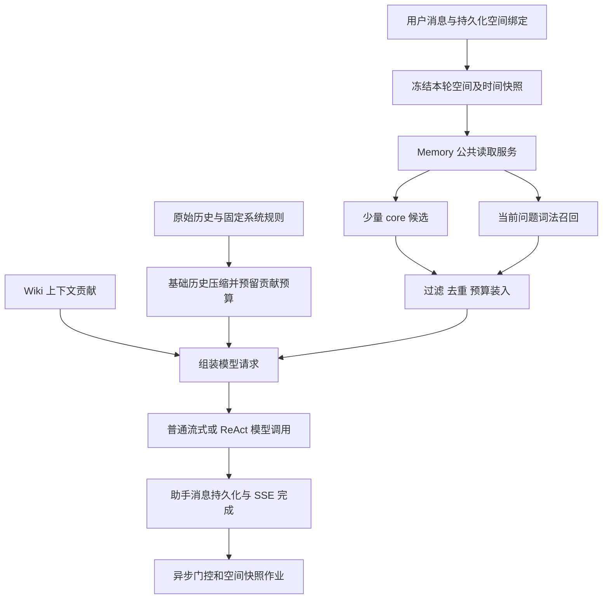

# 设计文档：记忆分层与 Memory 领域收敛

## 文档信息

| 属性               | 值                                                                                                     |
| ------------------ | ------------------------------------------------------------------------------------------------------ |
| 编号               | DSGN-20260930-MEMORY                                                                                   |
| 状态               | 已实现；AC-001～AC-013 均通过 Harness 验收                                                             |
| 规格 / 计划 / 追溯 | [product-spec.md](product-spec.md) / [exec-plan.md](exec-plan.md) / [traceability.md](traceability.md) |
| 上位结构提案       | [Server 目录与领域边界收敛](../2026-09-29-server-structure/design-doc.md)                              |
| 源码事实           | [source-assessment.md](source-assessment.md)                                                           |

## 背景、目标与约束

将当前记忆 CRUD、操作解析、事务更新、模型提取、门控、worker、上下文拼接拆成可定位职责。采用 Server 结构提案中的单包领域目录；本变更仅细化 Memory 领域，不接管其余 Server 迁移。

保留 SQLite、现有 AI adapters、Jev 的独立设置、SSE 和 ServerRuntime 生命周期。Memory 通过应用接口参与聊天，不能反向导入 HTTP、messageService、ReAct 或 CLI。所有新增 API 仍从现有 endpoints 注册；物理入口不随本次领域整理批量移动。

## 参考 agentmemory 的取舍

| 参考实现                                         | Mint 采用方式                                                             | 调整原因                                                                          |
| ------------------------------------------------ | ------------------------------------------------------------------------- | --------------------------------------------------------------------------------- |
| working-memory 的 core/archival 及 30% core 预算 | 同一 memories 表增加显式 contextPolicy，core 上限与总上限分开配置         | 已有版本/审计表，不另造一套核心正文存储                                           |
| pinned slots 与 global/project 概念              | 用户指定常驻优先；明确知识空间 ID 与会话绑定                              | slots 的 project/global KV 本身不是完整的多知识空间隔离实现                       |
| context 的内容块、预算和访问记录                 | 单条事实为选择单元；最终包装复算；只统计实际入选                          | 原实现按 recency 装整块；working-context 的 pinned 项可越过 core 预算，不直接照搬 |
| search 的 BM25、可选向量、format/token_budget    | 本期独立 memory FTS5 词法索引；后续检索工具可返回 compact/full 两阶段结果 | 前台默认本地召回，普通聊天也能用；不强制新增模型请求                              |
| auto-page、strength/access 评分                  | 先提供显式取消常驻；访问统计作为诊断                                      | 自动注入会制造访问自强化，计数不等于有用，不自动晋升或删除                        |
| ProjectProfile、lessons、近期摘要                | 本期只提供小画像与检索事实                                                | 当前问题不需要每次携带项目摘要、经验和最近十次会话                                |

agentmemory 的 token/Recall 宣传数字不作为本方案收益预测。其自动 context 和独立 search 是不同路径；Mint 明确在请求前进行相关事实检索。详见参考源码证据。

## 方案选项与决策

| 方案                                                    | 收益                             | 成本与问题                                     | 决策           |
| ------------------------------------------------------- | -------------------------------- | ---------------------------------------------- | -------------- |
| A：保持 24+8，仅截短总字符串                            | 修改小                           | 无空间契约；截断可能破坏事实；画像仍按类型误判 | 不采用         |
| B：领域收敛 + core/retrievable + 空间 + 词法召回 + 预算 | 前台无额外外部调用；可控且可评估 | 需 migration、会话快照和管理入口；同义召回有限 | 本期采用       |
| C：接入完整 agentmemory/iii-engine                      | 功能多                           | 双持久化与外部进程、部署/关闭/身份成本高       | 不采用         |
| D：同时新增向量/图谱/反思与自动遗忘                     | 语义与关联召回上限更高           | 难以分辨哪项带来收益，扩展生命周期与一致性面   | 本期后单独评估 |

## DS-001：Memory 领域职责与目录

以下是本变更的目标路径；现有基础层不做全局搬迁。

```text
server/
  domains/memory/
    index.ts                    # 对外应用服务、契约与工厂导出
    types.ts                    # 领域类型，不依赖入口/运行时
    memoryService.ts            # 管理 CRUD、用户策略、批量归属
    memorySpaceService.ts       # 最小知识空间管理
    memoryContextService.ts     # 画像+召回+预算的读取用例
    memoryQuery.ts              # 中文/英文查询 token、匹配门槛
    memoryContextPacking.ts     # 候选过滤、确定性选择、转义与包装
    memoryPolicy.ts             # 默认预算、画像键、过滤/排序规则
    memoryOperationParser.ts    # 结构化与受限 legacy 操作解析
    memoryOperationService.ts   # 同作用域事实更新、审计事务
    memoryExtractionService.ts  # 提取提示词/校验/操作应用
    memoryJobService.ts         # worker 状态、快照、恢复/停止
    gates/                      # 门控接口、legacy 与选择策略
    ports.ts                    # Settings/Transcript/Extraction/Gate 外部能力
    __tests__/                  # 单元、SQLite、入口、作业/质量探针
  infrastructure/
    persistence/
      memoryRepository.ts
      memoryJobRepository.ts
      memorySpaceRepository.ts
      memorySearchRepository.ts
    ai/
      memoryExtractionAdapter.ts # 包装现有 AIAdapter
      jevMemoryGateProvider.ts   # 实现领域接口，复用现有 jevClient
  bootstrap/memory.ts           # 显式装配，不在 import 时启动
  services/contextProviders/
    memoryContextProvider.ts    # 薄适配：通过领域公共接口获得 contribution
  endpoints/definitions/
    memories.ts                 # 现有声明端点扩展
    memorySpaces.ts              # 新端点声明
    conversations.ts            # 新绑定端点声明
  migrations/index.ts           # 本期 migration，编号执行时分配
```

依赖规则：

1. 现有 HTTP/CLI、ContextProvider、聊天应用服务只导入 domains/memory/index.ts；禁止深层导入。
2. Memory 应用服务可依赖 memory 专属 infrastructure 实现；纯 types/policy/query/packing/parser 不依赖 DB、adapter、settings 或运行时。
3. infrastructure 可 type-only 引用领域契约，不能运行时回调领域应用服务或自行启动 worker。
4. Transcript、Settings 和外部模型/Jev 通过 ports 注入。装配层可连接 conversations 公共服务与已有 settings/adapter；Memory 不直接读取另一个领域的 repository。
5. scope 解析由 conversations 应用服务读取持久化会话绑定，再传给 Memory。Memory 只校验自己的空间状态，不读取 HTTP body 作为最终作用域。
6. worker 用状态对象与工厂封装调度/停止/drain 状态；保持小函数及 JSDoc，不引入 DI 框架。

迁移映射：memoryService 拆为管理/context/parser/operation/extraction；memoryJobService 进入领域；memoryGateProviders 的接口/legacy/策略进入 gates，Jev 实现进入 infrastructure/ai；两个现有 repositories 进入 persistence；分类常量进入 memoryPolicy；memory 类型从 server/types.ts 移出后仅保留 type re-export 兼容入口。共享 jevClient、AIAdapter 和通用 tokenEstimator 不在本次整体搬迁范围。

兼容 re-export 只在已知入口无法同批迁移时暂留，禁止双实现。本期完成前仓内消费者切到公共入口；其余旧 facade 移除，server/types.ts 的 type-only 兼容导出登记给上位结构提案。架构检查必须认识 domains/infrastructure/bootstrap，不能因新目录不在旧规则表中而漏检；按解析后的 import 和 export 路径检查动态 literal import、循环及跨域内部引用。

## DS-002：数据与知识空间契约

所有以下字段/表均为拟新增，不是现有能力。

| 对象                   | 字段与规则                                                                                                                                                                  |
| ---------------------- | --------------------------------------------------------------------------------------------------------------------------------------------------------------------------- |
| memories               | context_policy: core/retrievable；policy_source: user/auto/migration；scope_kind: global/space/unassigned；space_id: string/null                                            |
| memory_spaces          | id: UUID；name: trim 后 1～80 字符；archived_at: UTC ISO/null；created_at、updated_at。同名可以存在，身份只看 ID                                                            |
| conversations          | memory_space_id: string/null；memory_binding_revision: 非负整数，切换或解除绑定时递增；重复同值设置不递增                                                                   |
| memory_message_scopes  | message_id 主键；conversation_id、binding_revision、scope_kind、space_id、captured_at。用户/助手持久化时按 run 开始快照写入，不随绑定修改                                   |
| memory_processing_jobs | 增加 binding_revision、scope_kind、space_id；唯一键由 conversation_id 改为 (conversation_id,binding_revision)，保留 requested/processedThroughMessageId、有限重试及状态语义 |
| memory_events          | 增加 scope_kind、space_id、binding_revision 的摘要字段；仍禁止正文/value/原始响应                                                                                           |
| memory_search_fts      | FTS5：memory_id UNINDEXED、content_tokens、key_tokens、subject_tokens；索引投影与事实同事务维护，检索 join memories 作最终状态/时间/空间过滤                                |
| memory_search_meta     | 单行 tokenizer_version、updated_at；记录投影版本，启动装配显式检查并按事务重建，不在 import 时执行                                                                          |

数据库 CHECK 约束 scope_kind=space ⇔ space_id 非空；其他范围必须为空。spaceId 外键不以级联删除擦除正文；空间只归档不硬删除。运行时也校验，不能只依赖类型定义。

Migration 仅创建 SQL 结构，不反向导入领域 tokenizer。未归属旧数据不参与可检索投影；首次归属、创建、编辑、替代/删除通过领域用例生成投影并同事务写入。tokenizer_version 改变时，bootstrap 在接收记忆请求前显式触发受控重建：成功后原子切换版本，失败保留旧事实、标记索引不可用并省略相关召回，不把旧版本投影混入新查询；冷启动成本单列。无需新后台索引 worker。

旧 memories 全部保守回填 retrievable/migration/unassigned；不按 category 推断全局或项目。来源、正文、status、supersedesId 和已存在访问计数保留。用户批量归属触发同事务的事实冲突检查与索引更新，失败整批回滚。相同内容且属于同一单值键可归并版本；不同内容必须用户选择当前值，不能靠迁移随机留下一个。

旧会话绑定为 null，绑定版本从 1 开始；旧消息缺少 scope 快照视为 unassigned，不重新解释为新空间。migration 重建 jobs 表时保留旧作业 ID/快照/尝试数，legacy pending/processing 标记 failed，error_message=legacy_scope_unassigned 并记摘要；不对全段旧轨迹自动重新提取。执行时备份并验证新/旧 fixture，包括外键、FTS5、jobs 唯一键与失败关闭。

本期选择单数据库本地用户语义。新增多用户后必须将 owner 身份加入所有空间/唯一键/检索过滤，不能复用当前全局含义当作租户隔离。

## DS-003：画像准入、用户控制与事实更新

- 自动 core 白名单初值：preference.response_language、preference.response_style、personal.occupation、personal.timezone。需 global、subject=user、semantic、confidence ≥ 0.8，并引用包含用户明确表达的 sourceMessageId；助手推测不满足准入。
- 模型可提议策略但最终由 memoryPolicy 决定；不接受模型输出的 spaceId、bindingRevision 或 policySource=user。显式空间中自动提取的事实默认 retrievable；用户可将空间摘要设为 core。
- policySource=user 优先；更新事实时继承用户选择，除非用户显式修改。取消常驻不会被下一次自动提取重新提升。
- 批量策略变更、迁移归属、普通 CRUD 和自动提取都经过同一事务/校验边界；单值键按 (scopeKind,spaceId,memoryKey,subject) 定位候选。UPDATE 替代旧值，DELETE 只在该范围操作；泛化 general/旧分类键不能误删一整类事实。
- 输出保留来源日期与非 user 主体。一个知识空间的明确单值偏好可在该空间覆盖同键全局偏好；遮蔽只对登记的单值键生效，不能按 subject 或 category 大范围遮蔽。当前用户要求始终优先。

## DS-004：本地词法召回

本期选择 memory 专属 FTS5 投影，复用 SQLite 能力，不导入 Wiki 内部 searchRepository/生命周期；数据集与排序属于 Memory。

1. 读取 userContent 和最多两条近期用户原始消息，当前问题优先，整体截到 600 字符。短代词问题可借近期关键词形成 query；不会把模型生成内容反复检索为事实。
2. 纯 token 化：NFKC、英文小写，保留技术标识符单词；中文连续片段生成单字与相邻双字 token，过滤版本化停用字/通用问句片段，去重，上限 32 个。索引和 query 共用同一 tokenizer/version，无新 native segmenter 依赖。
3. FTS MATCH 参数化、逐 token 引号转义，用 OR 候选检索；先在 SQL join 条件施加 global/当前空间、active 和有效期，再 LIMIT 40。使用 bm25 排序，数值只是排序分数，不当作概率。
4. 相关性准入：英文必须至少命中一个非停用词标识；中文必须命中一个 query 双字 token，只有单字 query 时要求该单字匹配；同时有效 query token 覆盖率 ≥ 0.25。无有效 token/候选则空结果。门槛来自命名配置，评估后修改需记录新版本。
5. 合格候选先按 bm25 升序，再 importance 降序、updatedAt 降序、id 稳定排序；最多 8 条。importance 不允许把不相关内容拉入候选；默认不使用 accessCount 加分。
6. 与 core 按 ID 去重；同一事实键的失效旧版本再次过滤；最终由预算装入。管理列表不限于召回范围，必须与回答检索分开。

FTS 不提供无词面重合的同义检索。“SQLite”记忆未包含“数据库”时，数据库类泛问可能无法命中；单列未覆盖案例，后续才评估 embedding。FTS 缺失/异常时返回受控 degraded/空相关事实，可保留已成功读取的 core；禁止 fallback findAll 全量注入。

## DS-005：预算、装入与诊断

默认配置作为 MemoryPolicy 常量：totalTokens=2000、coreTokens=500、candidateLimit=40、recallLimit=8、queryChars=600。预算 API 接受正整数，测试内部允许 0；不首次增加一套可编辑设置页。

有效总预算 B=min(totalTokens, floor(inputBudget×0.1), remainingInputTokens)，所有值先限定非负。inputBudget 初期采用现有运行时输入预算口径，提供商精确模型窗口发现为后续独立能力；不能宣称该配置防止全部模型窗口溢出。先以 system、最新用户单元和 Wiki 贡献计算可预留额度，给记忆至多预留 2,000，再压缩较早历史；最终以真实组装余量收紧 B。不能让全部旧历史先占满预算，导致本可压缩的历史永久挤掉画像。普通路径也遵循相同口径，不只在 ReAct 限制。

选择过程：

1. 在请求快照时间过滤范围/状态/有效期，处理明确单值键的局部覆盖。
2. core 优先级：用户指定优先、importance 降序、memoryKey/subject/id 稳定顺序。完整渲染后在 min(500,B) 内装入，超长单条跳过；不因没有画像而伪造摘要。
3. 合格事实按 DS-004 顺序使用剩余 B。core 没用满的额度可被事实使用；core 不可借用突破 500。
4. 内容转义 <、>、&，保留换行与否定；按可读分类、固定顺序输出，不改变系统前缀。用户正文中的 closing tag 不能提前结束参考块。
5. 用 estimateMessagesTokens 对最终 contribution（含 role 开销、wrapper、分类标题、主体、来源时间）复算；超预算从最低优先级事实再到 core 逐条移除。B 不足以装任何事实时返回无 contribution。

返回 MemoryContextResult={contribution?,selectedIds,estimatedTokens,effectiveBudget,candidateCount,skippedCounts,policyVersion,indexVersion,degradedReason?}。selectedIds 在请求内部和受控测试产物使用；日志只记录数量、预算、耗时、枚举原因和版本。

skip 原因枚举：inactive、invalid_time、not_yet_valid、expired、out_of_scope、unassigned、low_relevance、duplicate、shadowed、over_budget、read_failed。记录实际投递到 adapter 的入选访问，不把管理列表和候选召回计为使用。同步批量更新访问计数在运行时管理范围内进行；失败不影响回答，不用无所有者的 fire-and-forget 写入。

## DS-006：请求组装与普通/ReAct 共用契约



应用契约拟定为：prepareMemoryContext({userContent,recentUserMessages,scopeSnapshot,now,inputBudget,remainingInputTokens}) → MemoryContextResult；无效 scope 在进入模型前返回域错误，其余读取失败可安全省略。

ContextProvider 从“同步提供文本”扩展为“收集可能异步的 contribution，然后显式 apply”。保持 provider order、唯一 ID、placement 和已有 Wiki system placement；不修改稳定系统提示词来动态拼接记忆。旧 applyContextProviders 在所有消费者切换后移除或仅作为明确兼容适配。

RunContextSnapshot 保存候选与贡献，基础 history 不包含记忆。每轮先在扣除贡献额度的预算内 prepareContext，再 apply contribution；不足时用同一候选快照重新装小预算，不重复召回、门控或将记忆写入摘要。ReAct 工具结果增长时也执行该步骤。最新用户内容优先；工具历史异常超过基础预算时不能通过固定画像挤掉用户问题。

普通流式、Agent 和 ReAct 都从 sendMessage 的同一入口获得快照，CLI chat/REPL 和 Electron 通过该应用服务复用。只补充显式快照/组装边界，不整体搬迁 reactLoopCore/ServerRuntime；保持 AIAdapter.call/stream 与 SSE 事件语义。实际 provider 用量只能作为旁证，不能将估算数当作账单数据。

## DS-007：空间快照、异步提取与关闭

memoryEnabled=false 在调用 Memory 读取/门控/作业能力前短路；管理请求不受该短路影响。仅在开启记忆的 run 中，由 conversations 应用服务读取 {scopeKind,spaceId,bindingRevision}；用户和助手持久化同时写 memory_message_scopes。关闭期间消息没有提取快照，重新开启后不自动补提取整段历史。禁止由模型决定归属；初期绑定变更在同会话 run 活跃时返回 busy，避免 UI 显示与正在生成的回复错位。

SSE 完成后，afterAssistantPersisted 通过现有 Jev→legacy 选择策略判定并入队。队列按 (conversationId,bindingRevision) 幂等，requestedThroughMessageId 更新；处理快照若期间新增消息，complete 将该行回 pending。worker 的 TranscriptPort 只返回相同 revision 的 user/assistant 原始消息，并截到 claimed throughMessageId；缺失快照不得退回整段会话历史。相同会话 A→B→A 使用不同 revision，旧作业不被覆盖。

提取仍使用当前设置和现有 adapter，结构化操作解析拒绝不走无约束 fallback。contextPolicy/作用域由服务校验并合成，事务内同时写记忆、版本、FTS、审计摘要；门控不产生正文，不改变 Jev unavailable/skip 的区别。

ServerRuntime 持有 bootstrap/memory 创建的运行实例：start 恢复 processing；afterAssistantPersisted 注册在途门控 Promise，而不是由 messageService 发起无所有者的 void 工作。stop 先禁止新工作，再等门控、scheduled/drain、在途提取和已启动访问更新结束，然后允许 SQLite 关闭。已经开始的门控在停止后不能继续入队；关闭期限沿用现有运行时契约，超时需要取消并确保任务留下可恢复状态，不能只 resolve Promise 却让回调继续写 DB。词法索引同步事务不新增后台线程；import 时只定义能力，不启动。

## DS-008：API、HTTP/IPC 与界面

以下均为拟新增/扩展契约，执行时通过 EndpointDescriptor 注册并同步客户端、preload、ElectronAPI、endpoint manifest。IPC 与 HTTP 共用应用服务、校验和错误码，不新增直接 Express route。

| API     | HTTP / preloadMethod                                                                                                | 契约                                                                                                                                                                         |
| ------- | ------------------------------------------------------------------------------------------------------------------- | ---------------------------------------------------------------------------------------------------------------------------------------------------------------------------- |
| API-001 | 既有 GET /api/memories / getMemories                                                                                | 保留 category 参数和数组返回；新增 scopeKind、spaceId、contextPolicy 可选管理过滤；默认 active，includeInactive=true 才显示历史状态                                          |
| API-002 | 既有 POST /api/memories、PUT /api/memories/:id / createMemory、updateMemory                                         | 新增 contextPolicy、scopeKind、spaceId、memoryKey、subject、有效期；手工创建默认 retrievable/global、UUID 记忆键，用户修改策略标 policySource=user；省略字段在更新时保持原值 |
| API-003 | 既有 DELETE /api/memories/:id / deleteMemory                                                                        | 用户软删除并同事务去索引、记摘要；列表/回答不再返回，source/version 继续保留；success=true shape 不变                                                                        |
| API-004 | GET、POST /api/memory-spaces / getMemorySpaces、createMemorySpace；PATCH /api/memory-spaces/:id / updateMemorySpace | GET {spaces}；POST/PATCH {space}；创建/改名/归档。归档在事务中解绑相关会话并增加 revision，既有历史空间事实保持原归属且不可召回；活跃 run 先按 busy 拦截                     |
| API-005 | PUT /api/conversations/:id/memory-space / setConversationMemorySpace                                                | body {spaceId:string\|null}，省略非法；返回 {conversation} 增加 memorySpaceId 与 memoryBindingRevision；创建/列表会话默认兼容 null                                           |
| API-006 | POST /api/memories/assign-scope / assignMemoryScope                                                                 | body {ids:string[],scopeKind:global\|space,spaceId:string\|null}；返回 {updated:number}；同批先检查后整体提交，拒绝未知/冲突                                                 |

扩展字段仅是新增行为，既有 rename/lockedAgent PATCH 不合并处理空间，避免现有优先分支吞掉字段。错误结构 {error:string,code:string} 对应 Spec 中的状态码；运行时未知值用 type guard，端点不得类型断言绕过校验。

界面：

- 设置/记忆页增加策略和空间过滤；每条显示“常驻画像”“按需召回”及归属，编辑时提供“每次参考”控件和有效期；常驻只显示优先级，不承诺一定装入。
- 历史未归属提示及批量归属；用户可以看到旧记录并明确选择目标，无静默自动迁移。
- 同页提供最小知识空间创建/改名/归档；会话头部可绑定空间或选择“用户全局”，busy 时显示可读原因并保留原绑定。
- 不增加独立工作区导航或 Wiki 路径管理。使用现有 Radix 表单与 tokens。
- 浏览器定位契约为语义 label 加少量 testId（settings-open、settings-close、settings-tab-memories、memory-panel、memory-card-<id>、memory-edit-<id>、memory-select-<id>、memory-assign-scope、memory-core-toggle、memory-scope-selector、conversation-memory-space）。新增控件不存在于当前实现，场景是待实现验收契约；mock 响应序列需在 TP-007 结合真实请求次数校准，不能用固定等待掩盖重挂载或重复请求。

## DS-009：观测与效果评估

生产诊断只记录 counts、estimatedTokens、effectiveBudget、latencyMs、skip 枚举、policy/index version、degraded 枚举；不复制 agentmemory 查询日志到 Mint。日志 spy 验证成功/失败路径均不出现 fixture 正文、query 或模型原始响应。

至少 30 个标注案例覆盖稳定画像、中文多字短语、英文技术标识、无关提问、代词上下文、过期/替代事实、同键跨空间、长记忆、旧数据、关闭开关。冻结案例及期望 eligible IDs，保存当前 24+8 基线与新选择结果；按最终 ranked retrieved candidates 计算 Recall@8，不从模型显示引用倒算。词法可回答子集目标 ≥0.85，无关注入率（无关入选条目/全部入选条目）≤0.10；无入选时该比率记 0，同时单列召回漏失。

单独报告无词面重合的同义案例，不能过滤后宣称总体语义能力通过。1 万条 fixture 基准至少预热 20 次、测量 100 次，记录 Node/SQLite、硬件、样本、p50/p95 和首轮索引成本；p95 ≤100ms 是设计目标。确定性检索/预算达标不证明真实模型会使用或遵循画像。需要真人/真实 provider 评估时另行明确数据范围与授权。

## DS-010：迁移批次、发布和回退

顺序：领域依赖/边界盘点 → 行为不变的 Memory 拆分迁移 → schema/空间/快照 → 词法索引 → 预算画像 → 请求/worker 接入 → 用户管理 → 综合验证。每批独立产出与回归，避免把路径迁移和行为变化混成无法定位的一步。

上位 Server 结构提案仍为待评审，本期只建立 Memory 领域边界和对接记录，不标记其其他领域/运行时 TP 完成。保留 repositories/db/migrations 等基础文件的其他职责；本期新增 infrastructure 路径不要求整个 Server 已完成搬迁。

发布前记录 schema 版本、备份位置和 migration fixture 证据。目录变更可独立回退；schema 升级后只能从备份或向前修复回退，不能让旧二进制在新 DB 上运行。关闭 memoryEnabled 可停止回答读写，但不能撤销 schema；FTS degraded 时省略相关事实，禁止全量注入兜底。

## 验收证据矩阵

| AC     | 设计 / 责任位置                               | 最低证据与关键观察                                              | probe                                        | 状态 |
| ------ | --------------------------------------------- | --------------------------------------------------------------- | -------------------------------------------- | ---- |
| AC-001 | DS-002、DS-003、DS-008 / migration、管理服务  | SQLite 前后 ID/内容/版本数量与查询结果；UI 未归属入口           | memory-integration、browser-ac               | PASS |
| AC-002 | DS-005、DS-006 / packing、请求组装            | 长/固定/零预算与最终 adapter 消息估算断言                       | memory-unit、memory-entry                    | PASS |
| AC-003 | DS-002、DS-004、DS-007 / scope、repository    | global/A/B 真实 SQLite fixture 与请求快照，invalid 不能扩大范围 | memory-integration、memory-entry             | PASS |
| AC-004 | DS-004 / query、FTS                           | 中文/标识符/空 query/零匹配/门槛边界                            | memory-unit、memory-integration              | PASS |
| AC-005 | DS-002、DS-003、DS-004 / operation、index     | 故障注入后事实/版本/FTS 均回滚；时间边界                        | memory-integration                           | PASS |
| AC-006 | DS-002、DS-007 / scopes、jobs、TranscriptPort | A→B→A、作业在途、新快照与重复操作观察                           | memory-integration、memory-entry             | PASS |
| AC-007 | DS-006、DS-007、DS-008 / provider、入口、UI   | off 后调用计数/DB 行数、UI 管理仍可保存                         | memory-entry、browser-ac                     | PASS |
| AC-008 | DS-006 / 普通与 ReAct、CLI、Electron          | adapter 捕获请求、压缩多轮、SSE 顺序；真实入口进程              | memory-entry、memory-process、electron-smoke | PASS |
| AC-009 | DS-003、DS-008 / 注册端点、preload、界面      | 真实持久化往返/字段一致与 browser 用户操作                      | memory-integration、browser-ac               | PASS |
| AC-010 | DS-001、DS-010 / 边界、构建/装配              | 解析路径/无新循环、typecheck/build/bundle 与入口探针            | boundary、memory-static、memory-entry        | PASS |
| AC-011 | DS-007 / worker、ServerRuntime                | 实际进程退出、恢复、DB-close 后写入为零；不能只 mock stop       | memory-lifecycle、memory-process             | PASS |
| AC-012 | DS-005、DS-009 / 日志与访问                   | fixture 内容不出日志，访问只对应最终 selected IDs               | memory-unit、memory-integration              | PASS |
| AC-013 | DS-009 / 固定案例与基准 runner                | ranked candidates、精确分母、基线、硬件与性能报告               | memory-quality                               | PASS |

此矩阵继承 Spec 的 risk/invariants 和 TP/probes；完整机器契约见 [verification-plan.json](verification-plan.json)。逐 AC 证据聚合见 `.harness/runs/2026-09-30-memory-context-optimization/2026-10-01T03-18-43-494Z-40308/claim-verification.json`；独立第三方审阅未执行，审计能力降级见 `verify-consistency.md`。上位 Server 结构提案的其他领域仍未实现。
